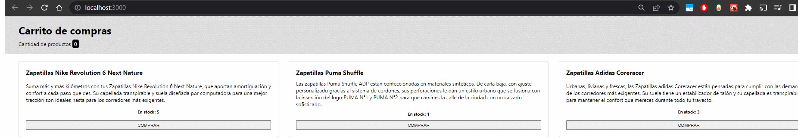

# FrontEnd III -- Entregable 1

- Componente Cabecera muestra cantidad de productos. Recibe props de cantidad.

- Componente Item maneja el click de su boton para restar la cantidad en stock de sí mismo y a su vez poder aumentar el estado de su "abuelo" App. Recibe como props {nombre, descripcion, stock y el métodos heredados para su uso}

- Componente Listado recibe el método para aumentar el estado de App y se lo pasa a cada uno de sus hijos.

# Demo del proyecto

Aquí pueden ver una demo del funcionamiento de la aplicación.

Certified Tech Developer -- DIGITAL HOUSE
Lucas Garcia
